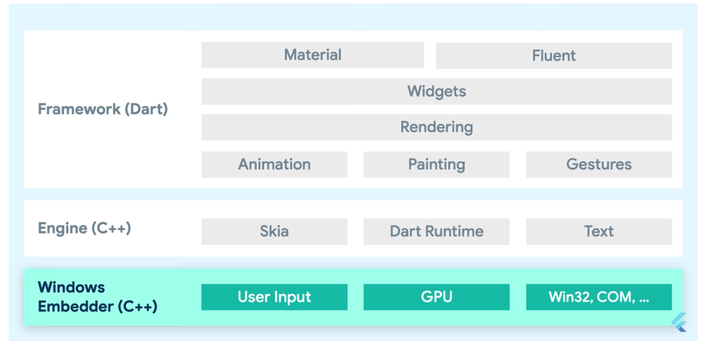
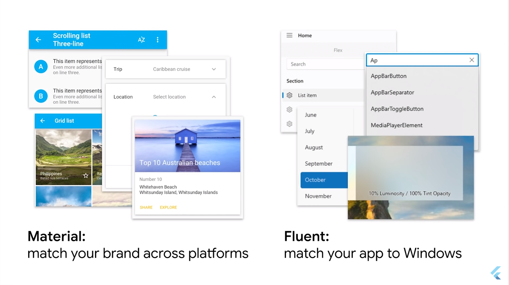
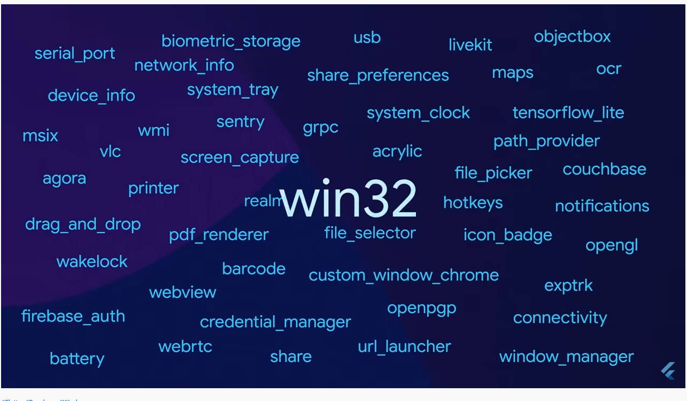

# Flutter no Desktop

## O que o Flutter Desktop compartilha com o Flutter para Mobile:

Fonte: [Evento Flutter Update](https://www.youtube.com/watch?v=g-0B_Vfc9qM)

* GPU-accelerated graphics
* rendering system
* animation
* theming
* text input
* globalization and localization
* hundreds of widgets
* importance of OS integration

## Específico no Desktop

* large displays
* mouse & keyboard input
* navigation
* input modes
* accessibility
* IMES
* visual styling
* means of OS integration (File System Pickers, Devices Hardware, Local DataStore)

## Windows

Versão 2.10 do Flutter trouxe a versão estável do Flutter Windows, que já estava disponível desde a versão ..., mas agora está pronto e com suporte para que seja utilizado em apps em produção.

Começando com Windows para a versão estável por conta da popularidade do Windows.

Dá para escolher que biblioteca UI pode ser utilizada, dentre as múltiplas oferecidas pelo Flutter. É possível criar seu próprio padrão visual, herdando do Material ou também há a disponibilidade para usar o Fluent (padrão visual do Windows - falam de todos os widgets necessários [vamos avaliar]).

### Fluent UI

* [Icones](https://pub.dev/packages/fluentui_system_icons)
* [Fluent UI](https://pub.dev/packages/fluent_ui)

## Photo Search App

Aplicação de exemplo para demonstrar o uso do Flutter no Desktop,
levando em conta as características de uma aplicação nesta plataforma.

* Material App

* Changend in the demonstration video, how to change to use fluent_ui
  
  https://youtu.be/g-0B_Vfc9qM?t=495

### Observações sobre distribuição e empacotamento

Binário gerado no modo Release é bem pequeno - 76Kb

* O runtime  é uma dll flutter_windows.dll (~ 14 MB) que deve ser empacotado junto com algumas outras dlls que podem ter sido providas por outros plugins/packages utilizados.

O binário tem excelente otimização e inicia de forma bem rápida.

Para empacotar tem uma ferramenta utilizando msix...

Utilizando msix, um instalador é gerado que é um formato compatível para para uso no Windows.

## Plugins disponíveis para windows

No pub.dev existem mais de 200 plugins e pacotes específicos para uso com o o Windows:

* msix
* camera
* barcode
* webview
* url_launcher
* share
* window_manager
* connectivity
* opengl
* notifications
* screen_capture
* shared_preferences
* usb
* biometric_storage
* network_info
* icon_badge
* wakelock
* custom_window_chrome
* printer
* openpgp
* sentry
* system_tray
* livekit
* objectbox
* ocr
* firebase_auth
* drag_and_drop
* pdf_renderer
* file_selector
* hotkeys
* win32
* maps
* webrtc
* tensorflow_lite
* serial_port
* path_provider

## Ferramentas

* LowCode - FlutterFLow
* CI/CD - CodeMagig

## Outras considerações

* Controle sobre cada pixel
* Animações
* Tema
* Smooth Scrolling

## Demo do Rive no Windows

[Vídeo](https://youtu.be/g-0B_Vfc9qM?t=984)

* Games
* Animações
* Icones animados
* Data Visualization
* Cartoons, Mascotes, etc

* Rive for Windows Desktop

Efficient memory usage

Best performance

Windows Desktop e Windows Tablets

Custom Title bar

## Outros destaques

Inclusive

[Accesbility](https://youtu.be/g-0B_Vfc9qM?t=1210)

Performance

Native Speed
Memory Overhead in MegaBytes
Optmized Binary

## Rows Spreadsheets

Spreadsheets in superpowers

* https://youtu.be/g-0B_Vfc9qM?t=1298

